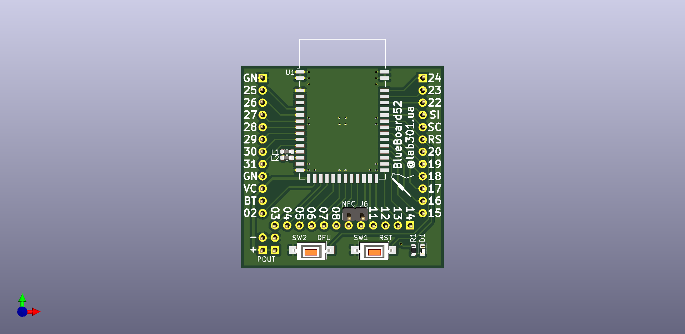
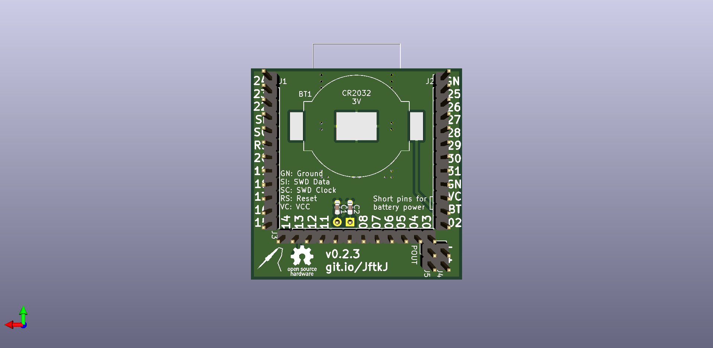

# blueboard52_base

This repostiory contains sources for the nRF52832-based board design that can be integrated into various projects.

For example, it has bottom headers and may be stacked on a base board like this: [ValentiWorkLearning/GradWork](https://github.com/ValentiWorkLearning/GradWork). Or may be used in some automobile models. Or for other purposes as you like.

If needed, the female headers may be soldered on top of the board for rapid prototyping, by analogy with Arduino Uno boards. But you may need to move pin annotations to the top header in this case.

And finally, here is the board. The top and bottom view images are below. Manufacture with blue soldermask for the best results :)

